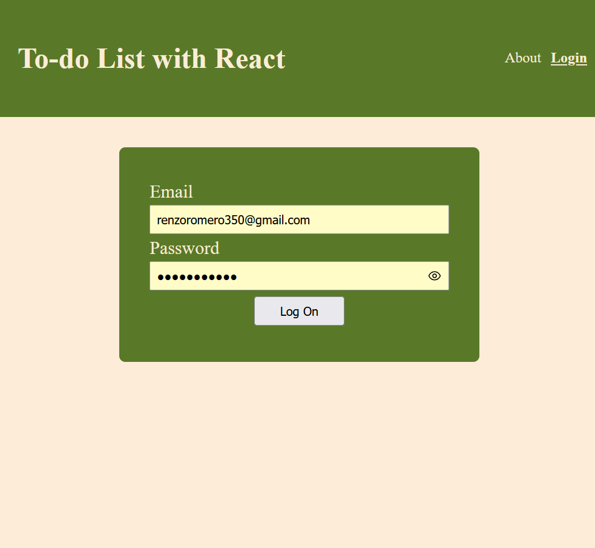
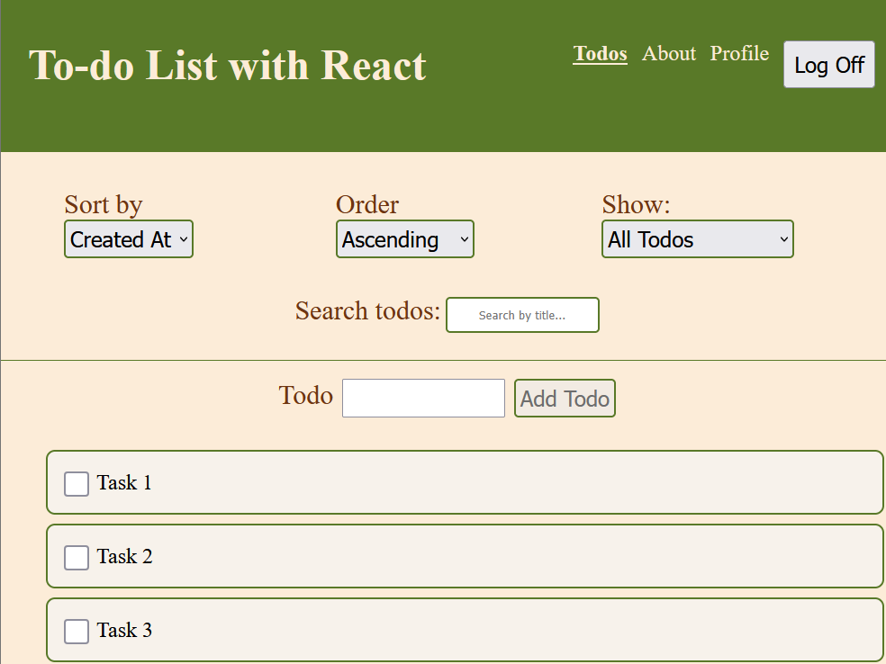
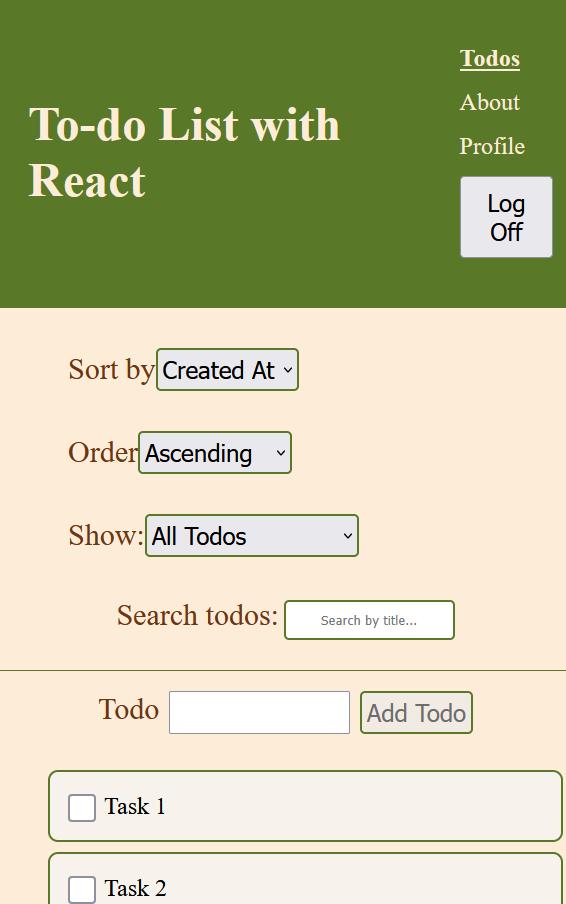

# To-Do App 

A Demo To-do List application built with React featuring adding, editing, deleting and filtering todos.This Demo demonstrates proficiency in React hooks, state management, component architecture, and responsive design, and error handling with custom validation and extra validation behind the scenes

## Screenshots

# Feature List
- Add task to keep track of
- Edit tasks
- Delete unwanted Tasks
- Filter existing todos by completed, title, created and change the order list
- form validation and dynamic navigation
- data persistence between reloads

# technologies Used

- **Frontend:** React 18, React Router, CSS Modules
- **State Management:** useReducer, Context API,useState
- **Build Tool:** Vite

## Installing

To install this app click [here](https://github.com/Coenzo19/todo-list) to begin the process. Open Git Bash and type:

> git clone <repo-url>
cd todo-list/

once your in your project directory type:

> npm install

## Running the App

If you are using Git Bash type this command to spin the server

> npm run dev

you should see a link that reads like this:

> http://localhost:5173/ 

open the link printed in the console rather than hard-coding a port.

## Design Principle

When designing this app, I wanted a User Interface with contasting colors that didn't blend together. It need to be easy to view, buttons or interactive elements need to be large and make it obvious what their purpose is.

## Future Improvements

- **backend authorization check**:  Removing sensitive information and relying more on backend authorization to show live sessions pass user data when the backend becomes available.Remove sensitive information from storage
- **Robust rollbacks**: Adding stronger rollback functionality when multiple todos are changed in rapid succession
- **further CSS styling**: Tweaking elements to align better and adjusting more for mobile

## Future Improvements
If you are curious about my journey, check me out at https://github.com/Coenzo19