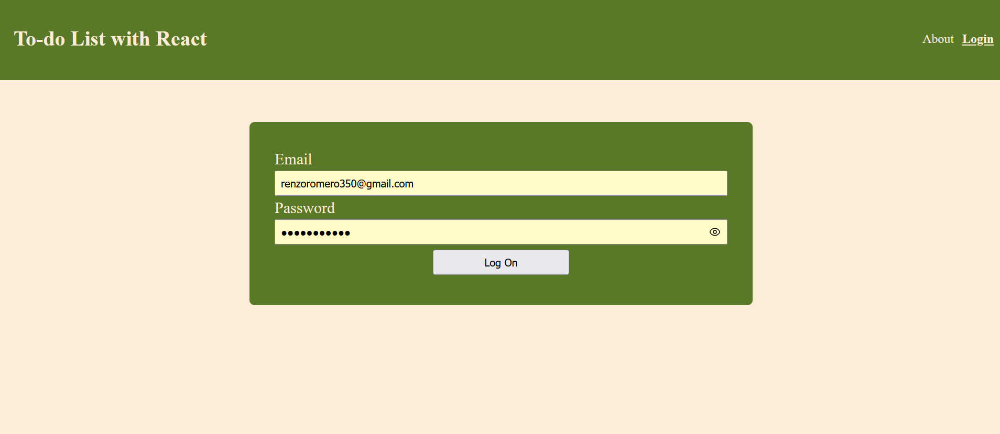
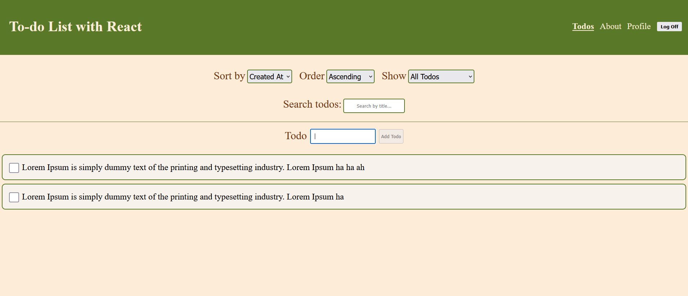
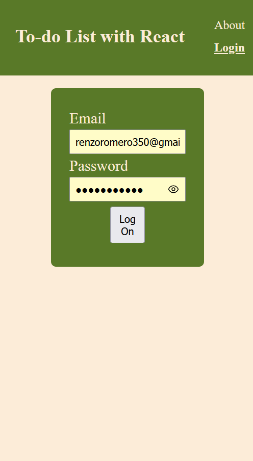
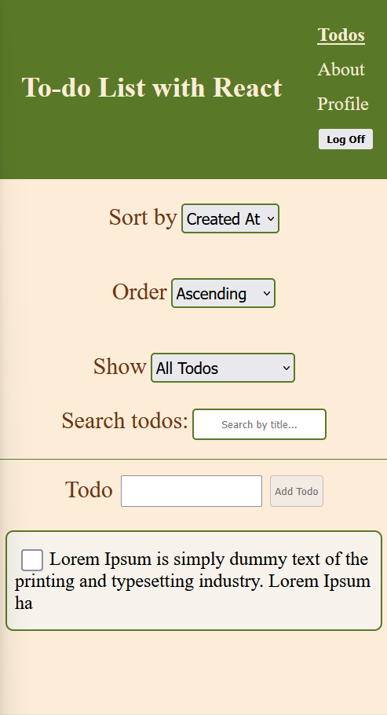

# To-Do App

A Demo To-do List application built with React featuring adding, editing, deleting and filtering todos.This Demo demonstrates proficiency in React hooks, state management, component architecture, and responsive design, and error handling with custom validation and extra validation behind the scenes

## Live Demo Link

Deployment is optional for this project, so no live demo is available.

## Screenshots
**Desktop**

**Mobile**

# Feature List

- Add task to keep track of
- Edit tasks
- Delete unwanted Tasks
- Filter existing todos by completed, title, created and change the order list
- form validation and dynamic navigation
- data persistence between reloads

# technologies Used

- **Frontend:** React 18, React Router, CSS Modules
- **State Management:** useReducer, Context API,useState
- **Build Tool:** Vite

## Installing

To install this app click [here](https://github.com/Coenzo19/todo-list) to begin the process. Open Git Bash and type:

> git clone <repo-url>
> cd todo-list/

once your in your project directory type:

> npm install

## Running the App

If you are using Git Bash type this command to spin the server

> npm run dev

you should see a link that reads like this:

> http://localhost:5173/

open the link printed in the console rather than hard-coding a port.

# Available Scripts

**npm install** — installs dependencies

**npm run dev** — starts the local development server

**npm run build** — creates the production build

**npm run preview** — previews the production build locally

## Design Decision

When designing this app, I used CSS Modules to make related styles easier to manage and to keep styles scoped to each component.

I used strong contrasting colors so text elements remain distinguishable and readable. I chose green, light green, brown, and peach because they stand out from one another and create clear visual separation. Consistent colors and hover states help users identify clickable elements.

The heading establishes the app’s purpose and provides clear navigation at the top of the page.

I designed the layout to adapt to smaller screens by using media queries to adjust the layout for mobile when a certain width threshold is met. Some examples are organizing link layouts and filters into columns, and adjusting font sizes to make the app compact for mobile. I kept the layout intentionally simple so the interface remains focused and easy to use.

I used a text sanitizer for todo input to remove unsupported characters and keep displayed content consistent, but I kept login validation separate to avoid changing password values.

## Future Improvements

- **backend authorization check**: Removing sensitive information and relying more on backend authorization to show live sessions pass user data when the backend becomes available.Remove sensitive information from storage
- **Robust rollbacks**: Adding stronger rollback functionality when multiple todos are changed in rapid succession
- **further CSS styling**: Tweaking elements to align better and adjusting more for mobile

## Contact Information

- **GitHub** https://github.com/Coenzo19

- **Portfolio:** https://www.artstation.com/rromero16

## License Information

Copyright (c) 2026 Renzo Romero

Permission is hereby granted, free of charge, to any person obtaining a copy of this software and associated documentation files (the “Software”), to deal in the Software without restriction, including without limitation the rights to use, copy, modify, merge, publish, distribute, sublicense, and/or sell copies of the Software, and to permit persons to whom the Software is furnished to do so, subject to the following conditions:

The above copyright notice and this permission notice shall be included in all copies or substantial portions of the Software.

THE SOFTWARE IS PROVIDED “AS IS”, WITHOUT WARRANTY OF ANY KIND, EXPRESS OR IMPLIED, INCLUDING BUT NOT LIMITED TO THE WARRANTIES OF MERCHANTABILITY, FITNESS FOR A PARTICULAR PURPOSE AND NONINFRINGEMENT. IN NO EVENT SHALL THE AUTHORS OR COPYRIGHT HOLDERS BE LIABLE FOR ANY CLAIM, DAMAGES OR OTHER LIABILITY, WHETHER IN AN ACTION OF CONTRACT, TORT OR OTHERWISE, ARISING FROM, OUT OF OR IN CONNECTION WITH THE SOFTWARE OR THE USE OR OTHER DEALINGS IN THE SOFTWARE.
